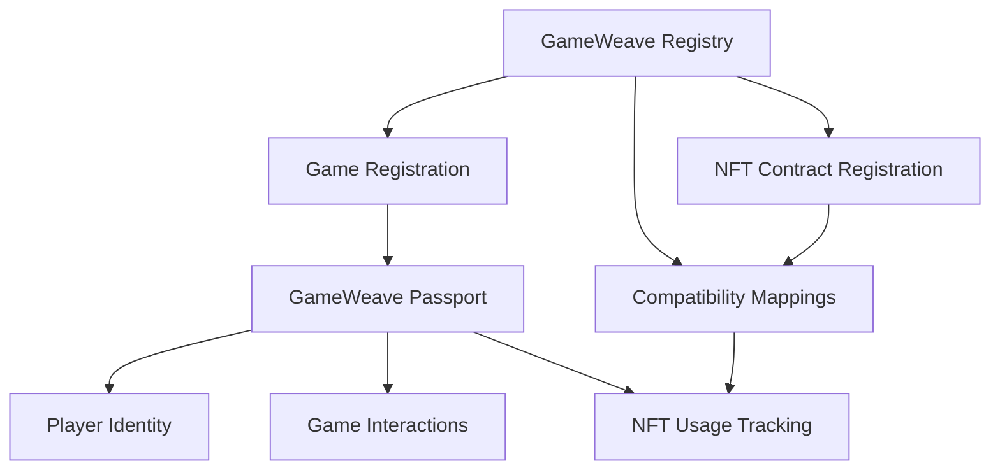

# GameWeave NFT Interoperability Platform

A decentralized platform enabling cross-game NFT compatibility and unified player identity in blockchain gaming.

## Overview

GameWeave creates a unified gaming ecosystem where NFT assets can be used across multiple blockchain games. The platform establishes standardized asset translation protocols that allow game developers to recognize and interpret NFTs from other games, enabling players to leverage their digital assets across different gaming environments.

### Key Features

- Cross-game NFT compatibility
- Centralized asset registry with translation protocols
- Player passport system for unified gaming identity
- Standardized game integration framework
- Secure asset validation and tracking

## Architecture

GameWeave consists of two main smart contracts that work together to enable NFT interoperability:



### Core Components

1. **Registry Contract**: Manages game registration, NFT contracts, and compatibility mappings
2. **Passport Contract**: Handles player identity and tracks cross-game NFT usage

## Contract Documentation

### GameWeave Registry (`gameweave-registry.clar`)

The central hub of the GameWeave ecosystem that maintains:
- Game registrations
- NFT contract registrations
- Cross-game compatibility mappings

#### Key Functions

- `register-game`: Register a new game in the ecosystem
- `register-nft-contract`: Register an NFT contract for compatibility
- `create-compatibility-mapping`: Define how NFTs translate between games
- `set-mapping-approval`: Approve or reject compatibility mappings

### GameWeave Passport (`gameweave-passport.clar`)

Manages player identities and tracks NFT usage across games through:
- Player passport creation
- Game interaction tracking
- Cross-game NFT usage history

#### Key Functions

- `create-passport`: Create a new player passport
- `record-game-interaction`: Track player engagement with games
- `record-nft-usage`: Log NFT usage across different games

## Getting Started

### Prerequisites

- [Clarinet](https://github.com/hirosystems/clarinet) installed
- Stacks wallet for deployment and testing
- Basic knowledge of Clarity smart contracts

### Installation

1. Clone the repository
```bash
git clone <repository-url>
cd gameweave
```

2. Install dependencies
```bash
clarinet requirements
```

3. Test the contracts
```bash
clarinet test
```

## Function Reference

### Registry Contract

```clarity
(register-game (name (string-ascii 64)) 
               (description (string-utf8 256)) 
               (website-url (string-ascii 128)))
;; Returns: (ok uint)

(create-compatibility-mapping (source-contract-id (string-ascii 128))
                            (target-game-id uint)
                            (translation-rules (string-utf8 1024)))
;; Returns: (ok bool)
```

### Passport Contract

```clarity
(create-passport)
;; Returns: (ok bool)

(record-nft-usage (player principal)
                  (nft-id (string-ascii 50))
                  (source-game (string-ascii 50))
                  (target-game (string-ascii 50)))
;; Returns: (ok bool)
```

## Development

### Local Testing

1. Start a local Clarinet console:
```bash
clarinet console
```

2. Deploy contracts:
```bash
clarinet deploy
```

3. Run the test suite:
```bash
clarinet test
```

### Integration Testing

Create test scenarios that:
- Register multiple games
- Create compatibility mappings
- Track NFT usage across games
- Verify passport functionality

## Security Considerations

### Access Control
- Only contract administrators can register NFT contracts
- Game updates restricted to registered game owners
- Passport operations limited to authorized games

### Data Validation
- All string inputs have strict length limits
- Compatibility mappings require approval before activation
- NFT contract validation before mapping creation

### Limitations
- No direct NFT transfer functionality
- Mapping updates require re-approval
- Game registration cannot be completely removed
- Limited query capabilities for historical data